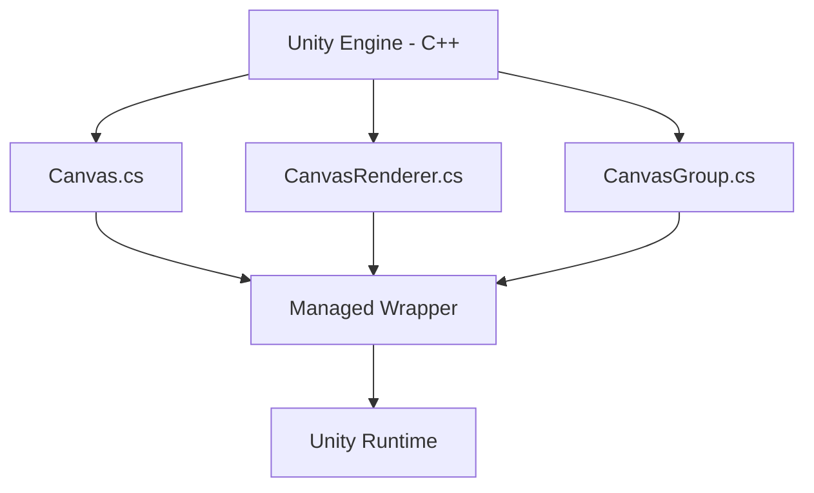
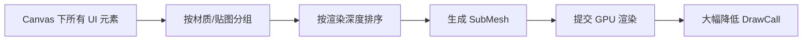
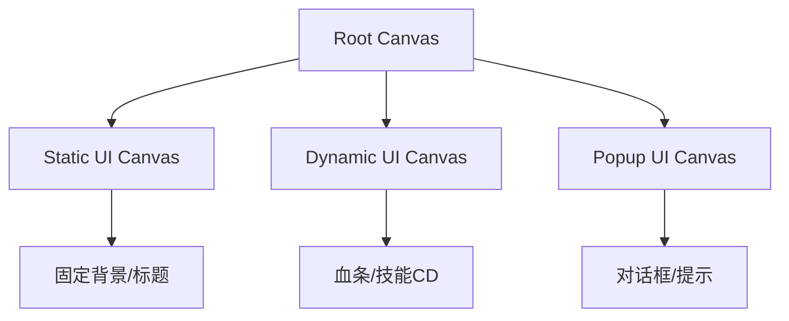
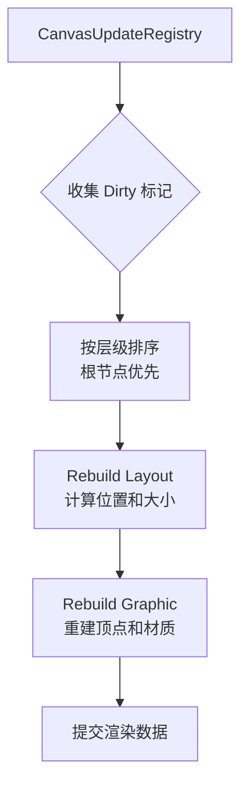
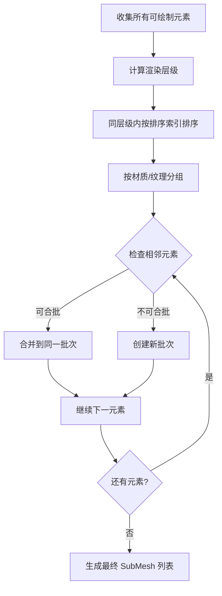
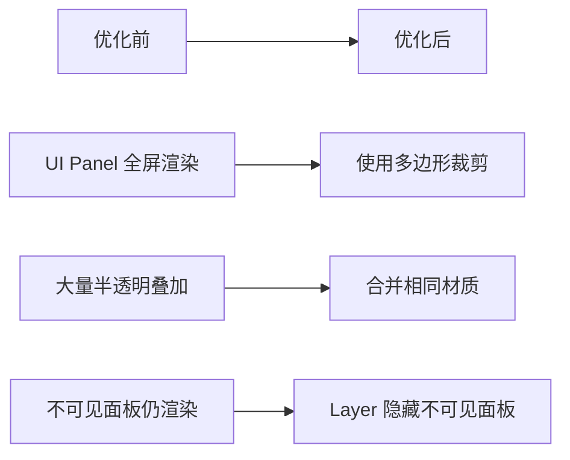

# 🎨 Unity UGUI Canvas 深度解析：从原理到优化的完全指南

> 💡 **你是否遇到过这些 UI 难题？**
> - 界面一复杂，帧率就掉到 30 以下？
> - 改了个按钮位置，整个界面都乱了？
> - 不理解 Canvas 的渲染模式，不知道什么时候用哪个？
> - DrawCall 居高不下，不知道如何优化？
>
> **别担心！** 这篇文章将带你深入 UGUI 的底层，从 C++ 实现到性能优化，彻底掌握 UI 开发的核心技能！

## 目录

- [一、Unity UI 系统概览](#一unity-ui-系统概览)
- [二、RectTransform 核心概念](#二recttransform-核心概念)
- [三、Canvas 的 C++ 层实现](#三canvas-的-c-层实现)
- [四、UI 控件分类体系](#四ui-控件分类体系)
- [五、UGUI 工作原理](#五ugui-工作原理)
- [六、Canvas 重建流程](#六canvas-重建流程)
- [七、合批原理深度解析](#七合批原理深度解析)
- [八、性能优化策略](#八性能优化策略)
- [九、团队规范建议](#九团队规范建议)

---

## 一、Unity UI 系统概览

Unity 提供了多种 UI 系统，开发者需要根据项目需求选择合适的方案。

### 1.1 UI 系统分类对比

| UI 系统 | 类型 | 适用场景 | 优缺点 |
|:-------|:-----|:---------|:-------|
| **UGUI** | 运行时 UI | 通用游戏 UI | ✅ 官方支持，部分 C++ 实现，性能优秀<br>❌ 灵活性相对较低 |
| **NGUI** | 运行时 UI | 旧项目维护 | ✅ 纯 C# 实现，高度可定制<br>❌ 需额外购买，性能略逊于 UGUI |
| **FGUI** | 跨引擎 UI | 多平台项目 | ✅ 跨引擎复用<br>❌ 学习成本高，需要额外工具 |
| **IMGUI** | 编辑器 UI | 编辑器工具开发 | ✅ 快速原型开发<br>❌ 仅限编辑器，性能较差 |
| **UI Elements** | 编辑器 UI | 自定义编辑器窗口 | ✅ 现代化，支持 USS 样式<br>❌ 仅限编辑器扩展 |

### 1.2 UGUI 的技术优势

UGUI 由 NGUI 作者参与开发，融合了两者的优势：

```
NGUI 的灵活性 + Unity 官方深度优化 = UGUI
```

**核心技术特点**：
- **混合实现**：核心逻辑在 C++ 层，上层 API 为 C#
- **自动合批**：智能合并 DrawCall，降低渲染开销
- **事件系统**：完善的射线检测和事件分发机制
- **动画集成**：与 Mecanim 动画系统无缝结合

---

## 二、RectTransform 核心概念

`RectTransform` 是所有 UI 控件的基础，继承自 `Transform`，专为 2D 矩形布局设计。

### 2.1 Pivot（轴心）- 旋转与缩放的锚点

轴心决定了控件变换的中心点，理解轴心对 UI 动画和定位至关重要。

| 轴心位置 | 坐标值 | 用途说明 |
|:-------|:------|:---------|
| 左下角 | (0, 0) | 用于左对齐的 UI 元素 |
| 右上角 | (1, 1) | 用于右对齐的 UI 元素 |
| 中心点 | (0.5, 0.5) | 最常用，均匀缩放和旋转 |

> 💡 **进阶技巧**：轴心可超出 (0,1) 范围！如设置为 (2, 0.5)，旋转时控件会围绕自身右侧某点进行，可用于创造特殊的旋转动画效果。

### 2.2 Anchors（锚点）- 响应式布局的核心

锚点定义了子控件相对于父控件的定位方式，是自适应 UI 的基础。

```
┌─────────────────────────────────────┐
│  父容器 (Parent RectTransform)        │
│  ┌───┐                               │
│  │A  │  四点合一 = 固定位置          │
│  └───┘                               │
│                                     │
│  ┌─────────────────────┐              │
│  │ A─────────────A     │              │
│  │                   │  分开设置 = 相对定位 │
│  └─────────────────────┘              │
└─────────────────────────────────────┘
```

**锚点的两种状态**：

| 状态 | 表现 | 典型应用 |
|:-----|:-----|:---------|
| **四点合一** | 子控件保持固定位置和大小 | 游戏内固定按钮、图标 |
| **分开设置** | 子控件随父容器变化而自适应 | 可变大小窗口、全屏面板 |

> ⚠️ **注意事项**：当父控件旋转或缩放时，子控件的最终位置由锚点计算得出。复杂的嵌套布局可能导致计算开销增大。

---

## 三、Canvas 的 C++ 层实现

UGUI 的性能优势部分源于其核心代码在 C++ 层的实现。

### 3.1 C++ 层组件架构



**关键组件及其职责**：

| 组件 | 职责 | C++ 层实现程度 |
|:-----|:-----|:-------------|
| `Canvas` | 画布根节点，管理渲染模式 | ⭐⭐⭐⭐⭐ 核心 |
| `CanvasRenderer` | 渲染数据收集与提交 | ⭐⭐⭐⭐⭐ 核心 |
| `CanvasGroup` | Alpha 和交互控制 | ⭐⭐⭐ 部分实现 |
| `Graphic` | 可绘制元素基类 | ⭐⭐⭐⭐ 高度优化 |
| `LayoutElement` | 布局计算接口 | ⭐ 轻量封装 |

### 3.2 多线程渲染支持

C++ 层实现带来了重要的性能优势：

- **子线程合批**：部分计算可在渲染线程执行
- **GPU Instancing**：自动支持实例化渲染
- **Native 内存管理**：减少 GC 压力

---

## 四、UI 控件分类体系

UGUI 提供了丰富的 UI 控件，按功能可分为三大类。

### 4.1 可视化控件

| 控件 | 功能 | 使用频率 | 性能考量 |
|:-----|:-----|:---------|:---------|
| **Text** | 文本显示 | ⭐⭐⭐⭐⭐ | 文字过多时顶点数高 |
| **Image** | 图像显示，支持九宫格 | ⭐⭐⭐⭐⭐ | 基础控件，性能良好 |
| **RawImage** | 原始图像，不压缩 | ⭐⭐⭐ | 避免频繁使用 |
| **Mask** | 遮罩裁剪 | ⭐⭐⭐ | 会打断合批 |

### 4.2 交互控件

| 控件 | 功能 | 基础实现 |
|:-----|:-----|:---------|
| **Button** | 点击按钮 | IPointerClickHandler |
| **Toggle** | 开关复选框 | IPointerClickHandler |
| **ToggleGroup** | 单选/多选组 | 控制子 Toggle 互斥 |
| **Slider** | 滑动条选择 | IPointerDragHandler |
| **Scrollbar** | 滚动条 | IPointerDragHandler |
| **Dropdown** | 下拉选单 | IPointerClickHandler |
| **InputField** | 文本输入 | IPointerClickHandler + 文本 API |
| **ScrollRect** | 滚动区域视图 | IPointerDragHandler |

### 4.3 自动布局系统

布局组件实现流式、网格等自适应布局。

```
Layout System 工作流程：
┌─────────────┐    ┌─────────────┐    ┌─────────────┐
│ Layout      │───▶│ Layout      │───▶│ 最终 UI     │
│ Element     │    │ Controller  │    │ 排列结果    │
│ (属性定义)   │    │ (计算驱动)   │    │             │
└─────────────┘    └─────────────┘    └─────────────┘
```

| 组件 | 功能 | 典型用途 |
|:-----|:-----|:---------|
| **LayoutElement** | 定义布局属性（最小/偏好/灵活尺寸） | 所有参与布局的元素基础 |
| **ContentSizeFitter** | 根据内容自适应大小 | 动态列表、聊天框 |
| **AspectRatioFitter** | 保持固定宽高比 | 视频播放器、图片展示 |
| **Horizontal/VerticalLayoutGroup** | 线性布局 | 菜单列表、工具栏 |
| **GridLayoutGroup** | 网格布局 | 背包格子、技能树 |

**布局计算优先级顺序**：

```
1. Minimum Size（最小尺寸）───▶ 确保基本可见性
         ↓
2. Preferred Size（偏好尺寸）───▶ 舒适展示内容
         ↓
3. Flexible Size（灵活尺寸）───▶ 分配剩余空间
```

---

## 五、UGUI 工作原理

深入理解 UGUI 的工作机制是性能优化的前提。

### 5.1 Canvas Batch 机制

UGUI 的核心优化在于合批（Batching），将多个 UI 元素合并为单个 Mesh。



**合批的三个必要条件**：

1. **材质相同**：使用相同的 Material 或 Atlas
2. **纹理相同**：使用相同的 Texture（或图集）
3. **深度连续**：在渲染队列中相邻，无其他元素穿插

### 5.2 Dirty 标记与重建

Canvas 采用脏标记（Dirty Flag）模式避免不必要的重建。

```csharp
// 脏标记类型
CanvasDirtyFlags.NONE          // 无需重建
CanvasDirtyFlags.LAYOUT         // 布局重建
CanvasDirtyFlags.GRAPHIC        // 图形重建
CanvasDirtyFlags.ALL            // 全部重建
```

**触发 Canvas 重建的操作**：

| 操作类型 | 触发条件 | 影响范围 |
|:-------|:---------|:---------|
| **属性修改** | Position/Rotation/Scale 变化 | 整个 Canvas |
| **内容修改** | Text 文本变化 | 整个 Canvas |
| **精灵替换** | Image Sprite 变化 | 整个 Canvas |
| **颜色修改** | Color 变化 | 仅顶点色（不重建） |

> 💡 **优化启示**：颜色动画通过顶点色实现，不会触发 Canvas 重建，是性能友好的动画方式。

### 5.3 Canvas 嵌套策略



**嵌套 Canvas 的优势**：
- 子 Canvas 的 dirty 状态不污染父 Canvas
- 可以独立控制渲染模式和排序
- 便于动静分离的 UI 架构设计

---

## 六、Canvas 重建流程

Canvas 重建是 UGUI 性能的关键环节，理解其流程有助于定位性能瓶颈。

### 6.1 重建触发时机

```
┌─────────────────────────────────────────┐
│           Unity 渲染循环                  │
│  ┌─────────────────────────────────┐   │
│  │ Camera.Render                   │   │
│  │   ↓                             │   │
│  │ CanvasUpdateRegistry.Update     │ ←─┴─ WillRenderCanvases 事件
│  │   ↓                             │
│  │ Canvas.UpdateCanvas            │
│  └─────────────────────────────────┘   │
└─────────────────────────────────────────┘
```

### 6.2 重建步骤详解



**各步骤详解**：

| 步骤 | 处理内容 | 性能影响 |
|:-----|:---------|:---------|
| **收集** | 遍历所有 Canvas，收集 dirty 标记 | O(n) |
| **排序** | 按 Hierarchy 层次排序 | O(n log n) |
| **Layout** | 计算布局元素的位置和大小 | 与布局复杂度相关 |
| **Graphic** | 重建顶点数据和索引 | 与顶点数相关 |

> ❓ **为什么根节点优先？**
> 父节点的布局计算结果是子节点定位的基础，必须先确定父容器的最终尺寸，子节点的相对位置才能正确计算。

---

## 七、合批原理深度解析

合批是降低 DrawCall 的核心机制，深入理解其原理至关重要。

### 7.1 渲染层级计算

UGUI 使用基于平面矩形相交的层级计算算法：

```
层级计算规则：
┌─────────────┐
│  UI Element │  层级 = 0  (下方无重叠)
│  [Depth: 0] │
└─────────────┘
      ↓ 重叠
┌─────────────┐
│  UI Element │  层级 = max(0, 1) = 1
│  [Depth: 1] │  (无法与上方合批)
└─────────────┘
```

**层级判定条件**：

| 条件 | 结果 | 原因 |
|:-----|:-----|:-----|
| 矩形范围无重叠 | 层级可相同 | 无遮挡关系 |
| 矩形范围有重叠 | 层级必须递增 | 确保正确的遮挡关系 |
| 使用 Mask | 层级必然递增 | Mask 强制打断合批 |

### 7.2 合批优化算法



**合批优化策略**：

1. **材质分组**：相同材质的元素优先合批
2. **纹理分组**：相同图集的元素优先合批
3. **减少层级切换**：保持相邻元素的层级一致性
4. **避免穿插**：UI 元素尽量不相互重叠遮挡

---

## 八、性能优化策略

基于 UGUI 的工作原理，总结出系统的优化方法论。

### 8.1 性能问题诊断矩阵

| 症状 | 可能原因 | 诊断工具 |
|:-----|:---------|:---------|
| **DrawCall 过高** | 合批失败、层级穿插 | Frame Debugger |
| **CPU 占用高** | Canvas 频繁重建 | Profiler (UI.Layout) |
| **GPU 占用高** | OverDraw 严重 | Frame Debugger (Overdraw) |
| **内存占用大** | 图集过多、纹理分辨率高 | Profiler (Memory) |
| **帧率不稳定** | GC 频繁、布局复杂 | Profiler (GC.Alloc) |

### 8.2 网格重建优化

**目标**：减少 Canvas.Rebuild 的调用频率和计算量。

| 优化策略 | 实施方法 | 效果评估 |
|:---------|:---------|:---------|
| **动静分离** | 将频繁变化的 UI 放入独立 Canvas | ⭐⭐⭐⭐⭐ 最有效 |
| **禁用 Pixel Perfect** | Canvas.PixelPerfect = false | ⭐⭐⭐⭐ 避免 layout 重建 |
| **避免 active 切换** | 使用 SetActive(false) → 使用 Scale(0,0) | ⭐⭐⭐ 减少 layout 重建 |
| **减少 Animator 控制** | 使用 DoTween 等补间插件 | ⭐⭐⭐ 避免 continuous rebuild |
| **优化 LayoutGroup** | 避免嵌套过多的布局组件 | ⭐⭐⭐ 降低计算复杂度 |

### 8.3 合批优化

**目标**：最大化合批效率，降低 DrawCall。

| 优化策略 | 实施方法 | 注意事项 |
|:---------|:---------|:---------|
| **图集整合** | 相同界面的 UI 元素使用同一图集 | 避免图集过大 |
| **层级对齐** | 相邻元素保持相同的 Sorting Order | 注意遮挡关系 |
| **慎用 Mask** | 必须使用时考虑 RectMask2D 替代 | RectMask2D 性能更好 |
| **移除空 Image** | 删除无实际渲染的 Image 组件 | 尤其是 Raycast Target = false 的 |
| **Canvas 合并** | 相同图集的元素尽量放在同一 Canvas | 平衡动静分离原则 |

> ⚠️ **Mask 性能陷阱**：
> - `Mask` 组件会创建额外的 DrawCall（通常增加 2 个）
> - `RectMask2D` 使用模板测试，性能优于 `Mask`
> - 多层嵌套的 Mask 会指数级增加 DrawCall

### 8.4 OverDraw 优化

**目标**：减少像素的重复渲染。



| 优化策略 | 实施方法 |
|:---------|:---------|
| **Polygon 模式** | Image.PolygonMode = Polygon 模式裁剪透明区域 |
| **关闭 Fill Center** | Sliced Image 不需要中间填充时关闭 |
| **禁用不可见面板** | 被遮挡的面板通过 Canvas Group 控制 |
| **EmptyRaycast** | 不需要射线检测的元素使用空组件替代 |
| **Camera 裁剪** | Screen Space - Camera 模式下屏幕外元素不渲染 |

### 8.5 字体渲染优化

字体是 UI 性能的隐形杀手。

| 优化策略 | 实施方法 | 性能提升 |
|:---------|:---------|:---------|
| **字符预加载** | `Font.RequestCharactersInTexture()` | 避免运行时图集扩展 |
| **使用美术数字** | 分数、倒计时用 Sprite 替代 Text | 避免动态字体重建 |
| **关闭 Best Fit** | 预设合适大小，避免实时计算 | 减少 layout 计算 |
| **减少 Effect** | 避免使用 Outline/Shadow | 顶点数增加 3-5 倍 |
| **使用动态字体** | 移除不使用的字符 | 减小图集尺寸 |

> 💡 **字体渲染原理**：
> - Text 组件的每个字符 = 4 个顶点（2 个三角形）
> - Outline 增加 4 倍顶点，Shadow 增加 3 倍顶点
> - 频繁变化的文本（如倒计时）应考虑用 Sprite 替代

### 8.6 滚动视图优化

长列表滚动是常见的性能瓶颈。

| 优化策略 | 实施方法 |
|:---------|:---------|
| **对象池技术** | 复用滚动项，避免实例化/销毁 |
| **RectMask2D** | 替代 Mask，裁剪屏幕外元素 |
| **虚拟滚动** | 仅渲染可见区域的项 |
| **基于位置排序** | 自定义排序逻辑，避免 LayoutRebuild |

### 8.7 通用优化技巧

| 技巧 | 说明 |
|:-----|:-----|
| **禁用无用 Raycast** | `Graphic.raycastTarget = false` |
| **注意 Z 轴位置** | 非零 Z 值会影响合批 |
| **使用 CanvasGroup** | 批量控制 Alpha 和交互 |
| **CanvasScaler 设置** | 选择合适的缩放模式 |

---

## 九、团队规范建议

良好的规范是团队协作的基石。

### 9.1 UI 模板标准化

```
标准 UI 模板体系：
┌─────────────────────────────────┐
│  标准窗口模板                    │
│  ┌───┬───┬───┬───┬───┐         │
│  │一级│二级│三级│按钮│图标│      │
│  │底板│底板│底板│   │   │      │
│  └───┴───┴───┴───┴───┘         │
└─────────────────────────────────┘
```

**模板规范**：

| 模板类型 | 尺寸规格 | 布局结构 | 适用场景 |
|:---------|:---------|:---------|:---------|
| **大窗口** | 1920×1080 | 一级底 + 二级底 | 主界面、设置面板 |
| **中窗口** | 1280×720 | 一级底 + 二级底 + 三级底 | 对话框、交易面板 |
| **小窗口** | 640×360 | 简化结构 | 提示框、确认面板 |

### 9.2 资源管理规范

| 规范项 | 要求 |
|:-------|:-----|
| **路径一致性** | 美术目录与客户端目录结构保持一致 |
| **命名规范** | 功能_颜色_尺寸，使用英文命名 |
| **图集管理** | 按功能模块划分，避免单个图集过大 |
| **图片分类** | UISprite（按钮）、UIFrame（边框）、Icon（图标） |

### 9.3 字体与颜色规范

**字体分级体系**：

```
字体分级 = 大中小 × 3种颜色 = 9 种标准规格
┌───┬───┬───┬───┬───┬───┬───┬───┬───┐
│大 │大 │大 │中 │中 │中 │小 │小 │小 │
│白│灰 │红 │白 │灰 │红 │白 │灰 │红 │
└───┴───┴───┴───┴───┴───┴───┴───┴───┘
```

**颜色管理**：
- 统一色值表（RGBA + 十六进制）
- Unity 颜色模板预设
- 禁止硬编码颜色值

---

## 十、总结与最佳实践

> "有规范就会有约束有限制，在一个团队的角度上来讲，大家遵守同一套规范，可以避免多余的沟通，增加开发效率，是保证团队协作、项目稳定推进的利器。"

### 最佳实践清单

**开发阶段**：
- ✅ 使用标准 UI 模板
- ✅ 遵循命名和路径规范
- ✅ 动静分离架构设计
- ✅ 合理使用图集

**优化阶段**：
- ✅ 使用 Profiler 定位瓶颈
- ✅ 优先处理高频变化的 UI
- ✅ 减少嵌套层级
- ✅ 避免不必要的 Mask

**测试阶段**：
- ✅ 目标平台真机测试
- ✅ 使用 Frame Debugger 验证合批
- ✅ 长时间运行稳定性测试

---

**相关阅读**：
- [Unity UGUI 优化系列](/tags/UGUI/)
- [Unity 渲染优化](/2020/05/08/Unity-Optimize/)
- [性能检测工具使用](/2020/05/08/Unity-Optimize/)

---

**转载请注明来源**，欢迎对文章中的引用来源进行考证，欢迎指出任何有错误或不够清晰的表达。可以在下面评论区评论，也可以邮件至 1487842110@qq.com
