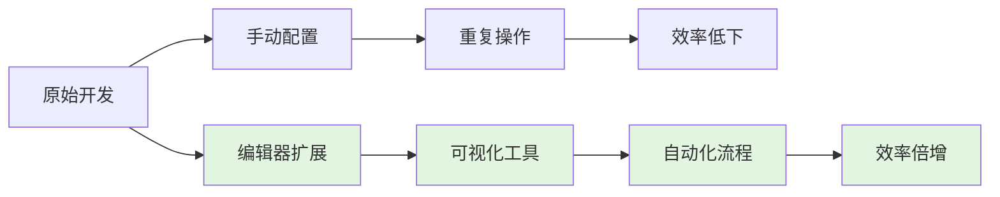
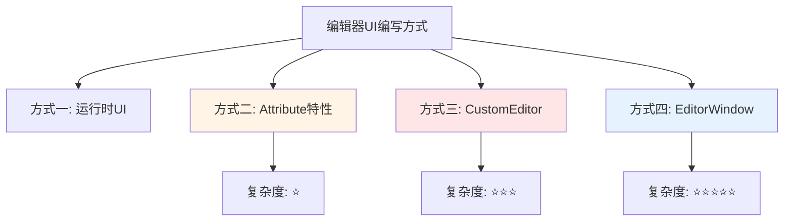
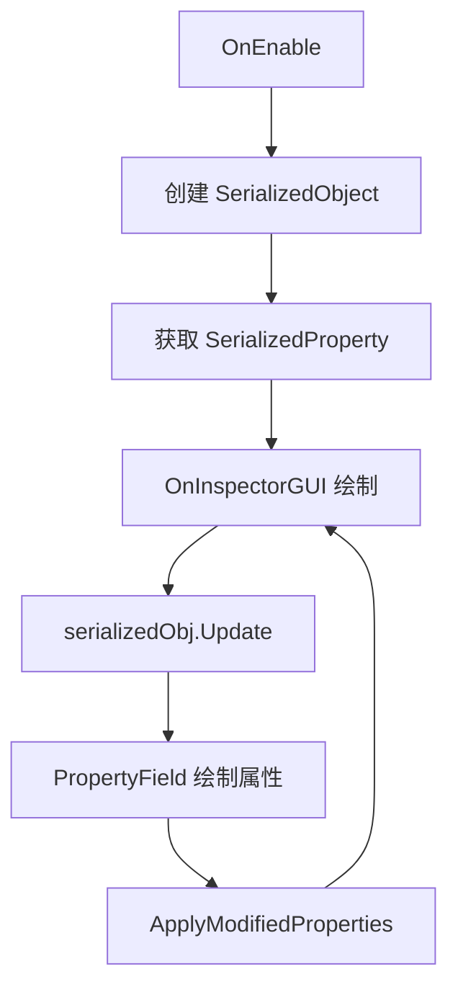
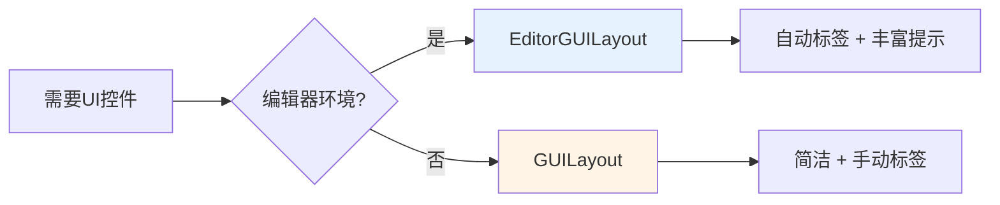
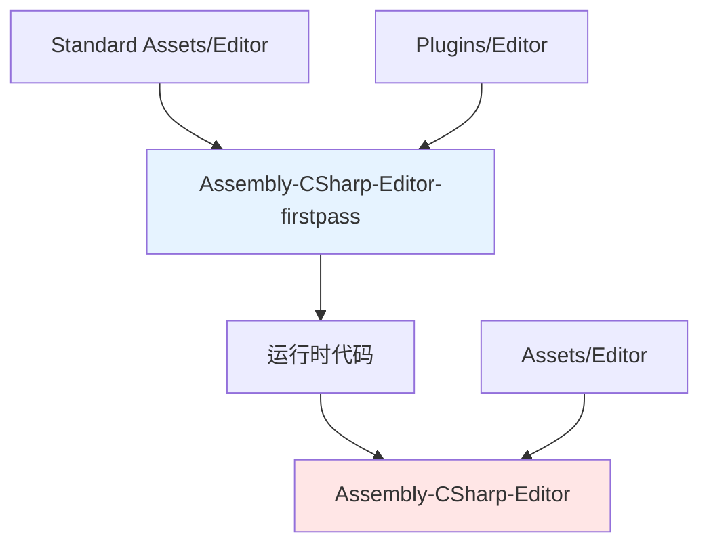
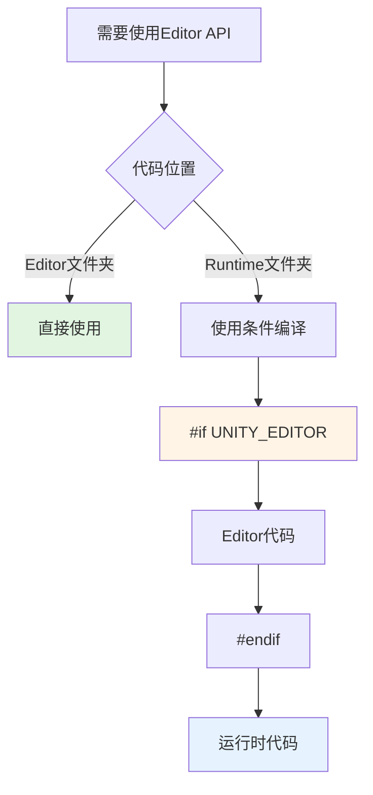

# 🛠️ Unity 编辑器扩展完全指南：从入门到大师的效率革命

> 💡 **你是否有过这样的经历**？
> - 配置一个关卡需要手动点击 100 次？
> - 每次打包都要重复 10 道繁琐步骤？
> - 策划想要快速调整参数，却只能每次都来找你？
> - 看着同事用自己写的工具 3 秒搞定，你还在手动操作 30 分钟？
>
> **别担心！** 这个系列将教你如何开发 Unity 编辑器工具，让你的开发效率**提升 10 倍**！

---

## 📖 开篇故事：工具的力量

### 从 3 小时到 3 秒的蜕变

小张是一名 Unity 开发者，每天的工作包括：

```
┌─────────────────────────────────────────────────────────────┐
│  ❌ 没有工具的小张：                                        │
│                                                             │
│  09:00  手动配置 50 个 NPC 的属性（2小时）                  │
│  11:00  调整 UI 预制体（30分钟）                             │
│  14:00  打包测试版本（1小时）                                │
│  16:00  修复配置错误（1小时）                                │
│                                                             │
│  结果：累成狗，还经常出错                                    │
└─────────────────────────────────────────────────────────────┘
```

学习了编辑器扩展后：

```
┌─────────────────────────────────────────────────────────────┐
│  ✅ 会写工具的小张：                                        │
│                                                             │
│  09:00  使用可视化配置工具（5分钟）                          │
│  09:05  一键调整 UI 预制体（3分钟）                          │
│  09:10  一键打包多版本（3分钟）                              │
│  09:15  工具自动检测错误（0错误）                            │
│                                                             │
│  结果：轻松愉快，有时间摸鱼...啊不，学习新技术！              │
└─────────────────────────────────────────────────────────────┘
```

**效率提升：3600%！** 🚀

> 💡 **核心真相**：**好的工具不是偷懒，而是让机器做它擅长的事，让你专注于创意！**

## 📚 目录

- [一、为什么学习编辑器扩展？](#一为什么学习编辑器扩展)
- [二、官方文档](#二官方文档)
- [三、编辑器 UI 的四种编写方式](#三编辑器-ui-的四种编写方式)
- [四、EditorGUILayout 与 GUILayout 的区别](#四editorGUILayout-与-GUILayout-的区别)
- [五、Editor 特殊文件夹](#五editor-特殊文件夹)
- [六、Editor Default Resources 文件夹](#六editor-default-resources-文件夹)
- [七、总结](#七总结)

---

## 🎯 一、为什么学习编辑器扩展？——从重复劳动到创意解放

编写游戏快捷工具可以显著提升开发效率，从以下五个维度来看：

| 🎨 工具类型 | 💡 解决什么痛点 | 📈 效率提升 | 🎯 适用场景 |
|-----------|--------------|----------|----------|
| **📊 可视化蓝图** | 手动配置参数易出错，策划看不懂代码 | ⭐⭐⭐⭐⭐ | 技能系统、任务配置 |
| **📦 打包流程自动化** | 每次打包重复操作，容易遗漏步骤 | ⭐⭐⭐⭐⭐ | 多版本测试、正式发布 |
| **🛠️ 服务器辅助工具** | 数据管理混乱，Excel 到游戏手动转换 | ⭐⭐⭐⭐ | 游戏数据、配置表 |
| **🎵 音视频工具** | 资源处理复杂，格式转换繁琐 | ⭐⭐⭐ | 音效管理、动画片段 |
| **⚡ 性能优化工具** | 性能问题难定位，需要逐个排查 | ⭐⭐⭐⭐ | Draw Call分析、内存检测 |

### 🎮 真实案例展示

**案例 1：技能配置工具**
```
❌ 传统方式：
- 打开代码 → 修改数值 → 保存 → 等待编译 → 进入游戏 → 测试
- 耗时：3分钟/次

✅ 可视化工具：
- 打开工具 → 拖动滑块 → 实时预览 → 保存
- 耗时：10秒/次

效率提升：18倍！
```

**案例 2：批量打包工具**
```
❌ 传统方式：
- 切换平台 → 等待 → 修改配置 → 构建 → 等待 → 打包 → 等待
- 耗时：30分钟/版本 × 5个版本 = 2.5小时

✅ 自动化工具：
- 点击"一键打包" → 喝杯咖啡 → 完成
- 耗时：30分钟（并行处理）

效率提升：5倍，节省2小时！
```

> 💡 **核心价值**：
> - **团队协作**：策划也能用，减少沟通成本
> - **减少错误**：工具自动校验，避免手误
> - **解放时间**：把重复劳动交给机器，你专注于创意
> - **提升士气**：从"搬砖工"变成"工具达人"

### 📊 效率提升路径图



---

## 二、官方文档

[Unity Editor 官方文档](https://docs.unity3d.com/Manual)

**搜索关键词**：`UnityEditor`

---

## 三、编辑器 UI 的四种编写方式

Unity 提供了四种编辑器 UI 编写方式，复杂度递增：



### 方式一：运行时 UI

不在本文讨论范围，指游戏运行时的用户界面。

---

### 方式二：特性 Attribute 编辑

使用 `UnityEngine` 特性属性，在检视面板中简单展示。

```csharp
using UnityEngine;

public class Player : MonoBehaviour
{
    [Header("角色属性")]
    [SerializeField] private int level = 1;

    [Range(0, 100)]
    public float health = 100f;

    [TextArea(3, 10)]
    public string description;

    [Tooltip("攻击力")]
    public int attack = 10;
}
```

| 特性 | 作用 | 使用场景 |
|------|------|---------|
| `[Header]` | 添加标题分隔 | 相关属性分组 |
| `[SerializeField]` | 在检视面板显示私有字段 | 封装公开属性 |
| `[Range]` | 滑动条限制数值范围 | 数值范围控制 |
| `[TextArea]` | 多行文本输入框 | 长文本输入 |
| `[Tooltip]` | 鼠标悬停提示 | 属性说明 |
| `[Space]` | 添加垂直间距 | 视觉分隔 |

> ⚠️ **注意**：Attribute 特性适合简单场景，复杂的自定义 UI 需要使用后两种方式。

---

### 方式三：CustomEditor 自定义检视面板

当特性属性无法满足需求时，使用 `CustomEditor` 自定义检视面板。

```csharp
using UnityEngine;
using UnityEditor;

[CustomEditor(typeof(Player))]
public class PlayerInspector : Editor
{
    private SerializedObject serializedObj;
    private SerializedProperty levelProp;
    private SerializedProperty healthProp;

    private void OnEnable()
    {
        serializedObj = new SerializedObject(target);
        levelProp = serializedObj.FindProperty("level");
        healthProp = serializedObj.FindProperty("health");
    }

    public override void OnInspectorGUI()
    {
        // 更新序列化对象
        serializedObj.Update();

        // 自定义绘制
        EditorGUILayout.LabelField("角色信息", EditorStyles.boldLabel);

        EditorGUI.indentLevel++;
        EditorGUILayout.PropertyField(levelProp, new GUIContent("等级"));
        EditorGUILayout.PropertyField(healthProp, new GUIContent("生命值"));
        EditorGUI.indentLevel--;

        // 应用修改
        serializedObj.ApplyModifiedProperties();
    }
}
```

**CustomEditor 工作流程**：



---

### 方式四：EditorWindow 窗口面板

开发复杂的独立工具窗口，如动画状态机、行为树编辑器等。

```csharp
using UnityEngine;
using UnityEditor;

public class BugReporterWindow : EditorWindow
{
    private string bugTitle = "";
    private string bugDescription = "";
    private int severity = 0;

    [MenuItem("Tools/Bug Reporter %#B")]
    static void ShowWindow()
    {
        var window = GetWindow<BugReporterWindow>("Bug Reporter");
        window.minSize = new Vector2(400, 300);
    }

    private void OnGUI()
    {
        GUILayout.Label("Bug 报告系统", EditorStyles.boldLabel);

        GUILayout.Space(10);

        bugTitle = EditorGUILayout.TextField("Bug 标题", bugTitle);
        bugDescription = EditorGUILayout.TextArea(bugDescription, GUILayout.Height(100));

        severity = EditorGUILayout.IntSlider("严重程度", severity, 0, 5);

        GUILayout.FlexibleSpace();

        using (new EditorGUI.DisabledScope(string.IsNullOrEmpty(bugTitle)))
        {
            if (GUILayout.Button("提交 Bug", GUILayout.Height(30)))
            {
                SubmitBug();
            }
        }
    }

    private void SubmitBug()
    {
        Debug.Log($"Bug 已提交: {bugTitle}");
    }
}
```

**EditorWindow 快捷键说明**：

| 快捷键格式 | 说明 | 示例 |
|-----------|------|------|
| `%#B` | Ctrl+Shift+B (Win) / Cmd+Shift+B (Mac) | `"Tools/Bug Reporter %#B"` |
| `%B` | Ctrl+B (Win) / Cmd+B (Mac) | `"Tools/Open %#O"` |
| `_B` | Shift+B | `"Tools/Save _S"` |

---

## 四、EditorGUILayout 与 GUILayout 的区别

| 区别 | EditorGUILayout | GUILayout |
|------|----------------|---------|
| **标签** | 每个控件有前置标签 | 无前置标签 |
| **提示信息** | 更丰富完整 | 较简洁 |
| **推荐用途** | 编辑器工具开发 | 运行时简单 UI |

```csharp
// GUILayout - 无标签
string bugName = GUILayout.TextField("bug name");

// EditorGUILayout - 有标签
string bugName2 = EditorGUILayout.TextField("Bug 名称", bugName2);
```

**选择建议**：



---

## 五、Editor 特殊文件夹

### 5.1 Editor 文件夹

| 路径 | 说明 | 优先级 |
|------|------|-------|
| `Assets/Editor` | 标准位置 | ⭐⭐⭐ |
| `Assets/xxx/Editor/` | 嵌套在任意文件夹下 | ⭐⭐ |

Editor 文件夹中的脚本使用 `UnityEditor` 命名空间，**不会被打包到游戏中**。

> ⚠️ **重要**：Editor 文件夹中的所有代码在最终构建时会被完全排除。

---

### 5.2 程序集编译规则

| 文件夹位置 | 编译目标 | 编译顺序 |
|----------|----------|---------|
| `Assets/Editor` | Assembly-CSharp-Editor.dll | 3 |
| `Standard Assets/Editor` | Assembly-CSharp-Editor-firstpass.dll | 1 |
| `Pro Standard Assets/Editor` | Assembly-CSharp-Editor-firstpass.dll | 1 |
| `Plugins/Editor` | Assembly-CSharp-Editor-firstpass.dll | 1 |

**编译顺序示意图**：



> ⚠️ **注意**：Assembly-CSharp.dll 中**不能**使用 UnityEditor.dll

---

### 5.3 模块引用原则

```
┌─────────────────┐
│   运行时模块      │  Assembly-CSharp.dll
│   (游戏代码)     │
└─────────────────┘
         ↑ 引用
┌─────────────────┐
│   编辑器模块      │  Assembly-CSharp-Editor.dll
│   (工具代码)     │
└─────────────────┘
```

| 引用方向 | 状态 | 说明 |
|---------|------|------|
| **Editor → Runtime** | ✅ 允许 | 编辑器模块可以引用运行时模块代码 |
| **Runtime → Editor** | ❌ 禁止 | 运行时模块不能引用编辑器模块代码 |

> 💡 **正确做法**：Editor 模块引用运行时模块代码
> 🚫 **错误做法**：运行时模块引用 Editor 模块代码

---

### 5.4 条件编译

如果不在 Editor 文件夹中的脚本需要使用 Editor API，需要使用条件编译：

```csharp
using UnityEngine;
#if UNITY_EDITOR
using UnityEditor;
#endif

public class NewBehaviourScript : MonoBehaviour
{
    private void OnEnable()
    {
#if UNITY_EDITOR
        EditorWindow.GetWindow<ExampleWindow>();
#endif
    }
}
```

| 宏定义 | 说明 | 平台 |
|--------|------|------|
| `UNITY_EDITOR` | 编辑器环境中 | 所有编辑器 |
| `UNITY_EDITOR_WIN` | Windows 编辑器 | Windows |
| `UNITY_EDITOR_OSX` | macOS 编辑器 | macOS |
| `UNITY_EDITOR_64` | 64 位编辑器 | 64位系统 |
| `UNITY_STANDALONE` | 独立构建平台 | PC/Mac/Linux |

**条件编译决策图**：



---

## 六、Editor Default Resources 文件夹

用于存放仅 Editor 模块可使用的资源，类似于 `Resources` 文件夹，但**不会被打包到游戏中**。

### 6.1 加载资源

```csharp
// 加载 Editor Default Resources 中的资源
Texture tex = EditorGUIUtility.Load("logo.png") as Texture;
Material mat = EditorGUIUtility.Load("Materials/UI.mat") as Material;
```

**资源加载路径对照**：

| 资源路径 | 加载代码 | 说明 |
|---------|---------|------|
| `Assets/Editor Default Resources/logo.png` | `"logo.png"` | 根目录直接访问 |
| `Assets/Editor Default Resources/Materials/UI.mat` | `"Materials/UI.mat"` | 子目录路径访问 |

---

### 6.2 查看所有内置资源

Unity 内置了大量编辑器资源，以下代码可查看所有内置资源名称：

```csharp
[MenuItem("Tools/查看内置资源 %#I")]
static void GetBuiltinAssetNames()
{
    var flags = BindingFlags.Static | BindingFlags.NonPublic;
    var info = typeof(EditorGUIUtility).GetMethod("GetEditorAssetBundle", flags);
    var bundle = info.Invoke(null, new object[0]) as AssetBundle;

    foreach (var name in bundle.GetAllAssetNames())
    {
        Debug.Log(name);
    }
}
```

**常见内置资源类型**：

| 资源类型 | 说明 | 路径前缀 |
|---------|------|---------|
| 图标（Icons） | 编辑器图标 | `Icons/` |
| 脚本图标（Script Icons） | 脚本类型图标 | `ScriptableObject/` |
| 样式（Styles） | GUI样式 | `Styles/` |
| 皮肤（Skins） | GUISkin | `Skin/` |

**Editor Default Resources 与 Resources 对比**：

| 特性 | Editor Default Resources | Resources |
|------|------------------------|-----------|
| **打包到游戏** | ❌ 否 | ✅ 是 |
| **仅编辑器可用** | ✅ 是 | ❌ 否 |
| **加载方式** | `EditorGUIUtility.Load()` | `Resources.Load()` |
| **目录要求** | `Assets/Editor Default Resources/` | `Assets/Resources/` |

---

## 🎓 七、总结与实战建议

### 📝 核心知识点回顾

| 主题 | 🎯 要点 | 💎 复杂度 | ⏱️ 学习时间 |
|------|-------|---------|-----------|
| **四种 UI 方式** | Attribute → CustomEditor → EditorWindow → 复杂工具 | ⭐ ~ ⭐⭐⭐⭐⭐ | 2-4周 |
| **Editor 文件夹** | 代码不会被编译到游戏中，安全隔离 | ⭐ | 10分钟 |
| **条件编译** | 运行时代码中使用 Editor API 的正确方式 | ⭐⭐ | 30分钟 |
| **Editor Default Resources** | 仅编辑器使用的资源文件夹，不会打包 | ⭐⭐ | 20分钟 |

### 🛤️ 学习路径建议

```
┌─────────────────────────────────────────────────────────────────────────┐
│                    Unity 编辑器扩展学习路线图                           │
├─────────────────────────────────────────────────────────────────────────┤
│                                                                         │
│  📍 第一周：基础入门                                                    │
│  ┌─────────────────────────────────────────────────────────────────┐   │
│  │ Day 1-2: 学习 Attribute 特性                                    │   │
│  │         → [Header]、[Range]、[Tooltip] 等                      │   │
│  │ Day 3-4: 掌握 Editor 文件夹规则                                 │   │
│  │ Day 5-7: 简单实践：为现有类添加自定义 Inspector                  │   │
│  └─────────────────────────────────────────────────────────────────┘   │
│                                                                         │
│  📍 第二周：进阶技能                                                    │
│  ┌─────────────────────────────────────────────────────────────────┐   │
│  │ Day 8-10: 学习 CustomEditor 和 SerializedObject                 │   │
│  │ Day 11-12: 掌握 EditorGUI 基础控件                              │   │
│  │ Day 13-14: 实战：重写项目核心类的 Inspector                     │   │
│  └─────────────────────────────────────────────────────────────────┘   │
│                                                                         │
│  📍 第三周：窗口开发                                                    │
│  ┌─────────────────────────────────────────────────────────────────┐   │
│  │ Day 15-17: EditorWindow 基础                                    │   │
│  │ Day 18-19: EditorGUILayout 布局系统                              │   │
│  │ Day 20-21: 实战：开发一个简单工具窗口                            │   │
│  └─────────────────────────────────────────────────────────────────┘   │
│                                                                         │
│  📍 第四周：综合实战                                                    │
│  ┌─────────────────────────────────────────────────────────────────┐   │
│  │ Day 22-24: 开发完整的编辑器工具                                  │   │
│  │ Day 25-26: 优化工具性能和用户体验                                │   │
│  │ Day 27-28: 总结和分享                                            │   │
│  └─────────────────────────────────────────────────────────────────┘   │
│                                                                         │
└─────────────────────────────────────────────────────────────────────────┘
```

### ⚡ 快速上手指南

> 🎯 **30秒快速测试**：
> ```csharp
> using UnityEngine;
> using UnityEditor;
>
> public class QuickTest : EditorWindow
> {
>     [MenuItem("Tools/我的第一个工具 %_T")]  // Ctrl+Shift+T
>     static void ShowWindow()
>     {
>         GetWindow<QuickTest>("我的工具");
>     }
>
>     void OnGUI()
>     {
>         if (GUILayout.Button("点击我"))
>             Debug.Log("Hello Editor!");
>     }
> }
> ```
> 复制这段代码到 `Assets/Editor` 文件夹，按 `Ctrl+Shift+T`，你的第一个工具就诞生了！✨

### 💎 实战技巧

| 技巧 | 说明 | 效果 |
|-----|------|------|
| **从小工具开始** | 先做简单的工具，逐步增加复杂度 | 快速建立信心 |
| **参考官方代码** | Unity GitHub 上有大量编辑器工具源码 | 学习最佳实践 |
| **多用快捷键** | `[MenuItem("Tools/XXX %#K")]` | 提升使用频率 |
| **实时预览** | 使用 `EditorUtility.SetDirty()` 标记修改 | 即时反馈 |
| **错误处理** | 用 `try-catch` 包裹关键代码 | 避免工具崩溃 |

### 🚨 常见误区

> ❌ **误区 1**："编辑器扩展很难"
> - ✅ 真相：从简单的 Attribute 开始，难度逐级递增
>
> ❌ **误区 2**："只有程序员能用编辑器工具"
> - ✅ 真相：好的工具策划、美术也能用
>
> ❌ **误区 3**："写工具浪费时间"
> - ✅ 真相：写工具花1小时，能节省100小时
>
> ❌ **误区 4**："必须学完所有 API 才能开始"
> - ✅ 真相：边做边学，实践中进步最快

---

## 🔮 下一步：系列预告

本系列将涵盖以下主题：

1. **EditorGUILayout 常用控件和方法** ← 下一篇
2. **EditorGUILayout**
3. **EditorWindow 案例**
4. **Custom Editor & Property Drawer**
5. **MenuItem 高级用法**
6. **Handles & Gizmos 可视化**
7. **节点编辑器开发**
8. **自动化打包工具**
9. **性能分析工具**

---

## 📚 延伸阅读

**🔗 官方资源**：
- [Unity Editor 官方文档](https://docs.unity3d.com/Manual)
- [Unity Editor Scripting API](https://docs.unity3d.com/ScriptReference/UnityEditor.Editor.html)

**💡 推荐文章**：
- [Unity Editor Tools Demystified](https://blog.unity.com/technology/unity-editor-tools-demystified)
- [Customizing the Inspector](https://learn.unity.com/tutorial/customizing-the-inspector)

**🎮 优秀案例**：
- Unity GitHub：[UnityCsReference](https://github.com/Unity-Technologies/UnityCsReference)
- 社区工具：[Odin Inspector](https://odininspector.com/)（商业插件）

---

## 💌 反馈与交流

如果你在学习过程中遇到问题，或者有更好的实践经验，欢迎交流！

- 📧 邮箱：1487842110@qq.com
- 💬 评论区：欢迎留言讨论
- 🔗 转载请注明出处

---

**🎊 感谢阅读！**

希望这个系列能帮助你掌握 Unity 编辑器扩展的开发。记住：**工具是杠杆，能让你撬动更大的创意！**

> 🌟 **最后一句忠告**：
> **"最好的工具是你自己写的工具。"**
> —— 某位从重复劳动中解放的开发者

---

```
   ┌────────────────────────────────────────┐
   │                                        │
   │   🛠️✨ Happy Tool Building! ✨🛠️     │
   │                                        │
   │   愿你的工具越来越强大！                │
   │                                        │
   └────────────────────────────────────────┘
```
