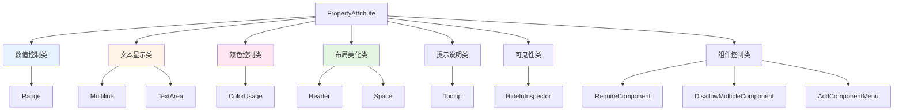
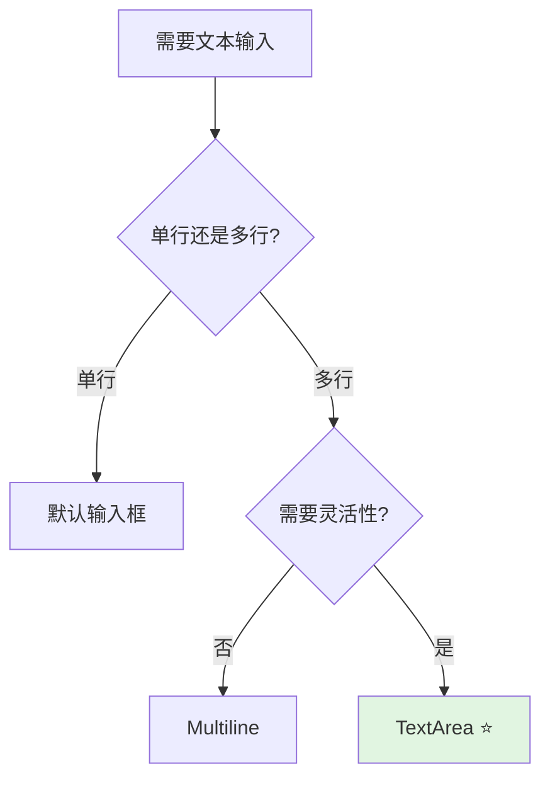
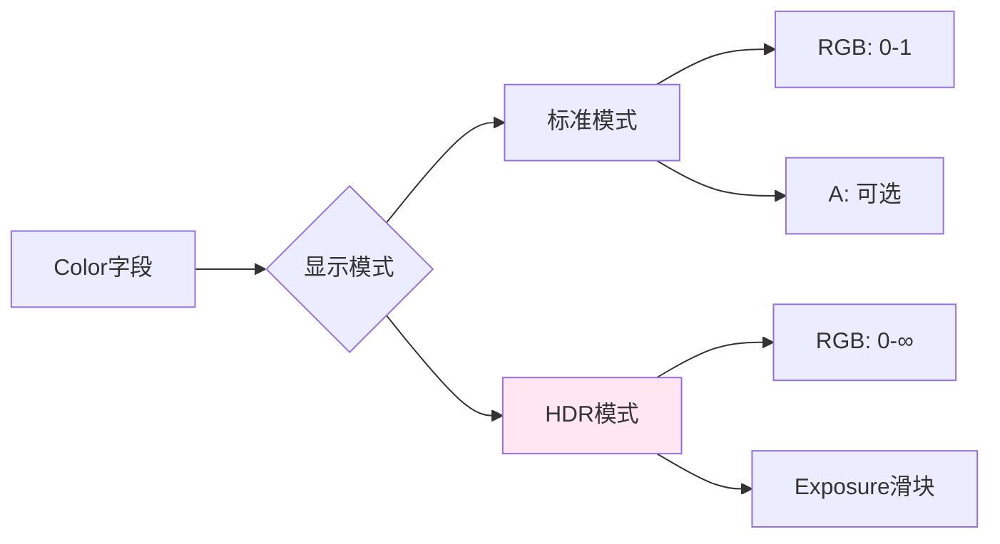
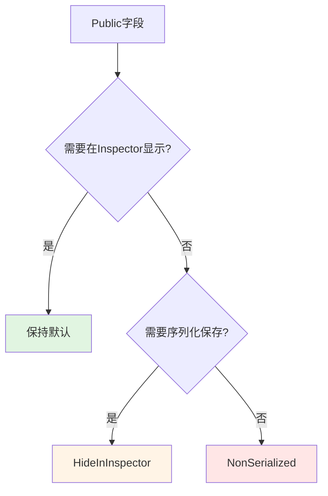
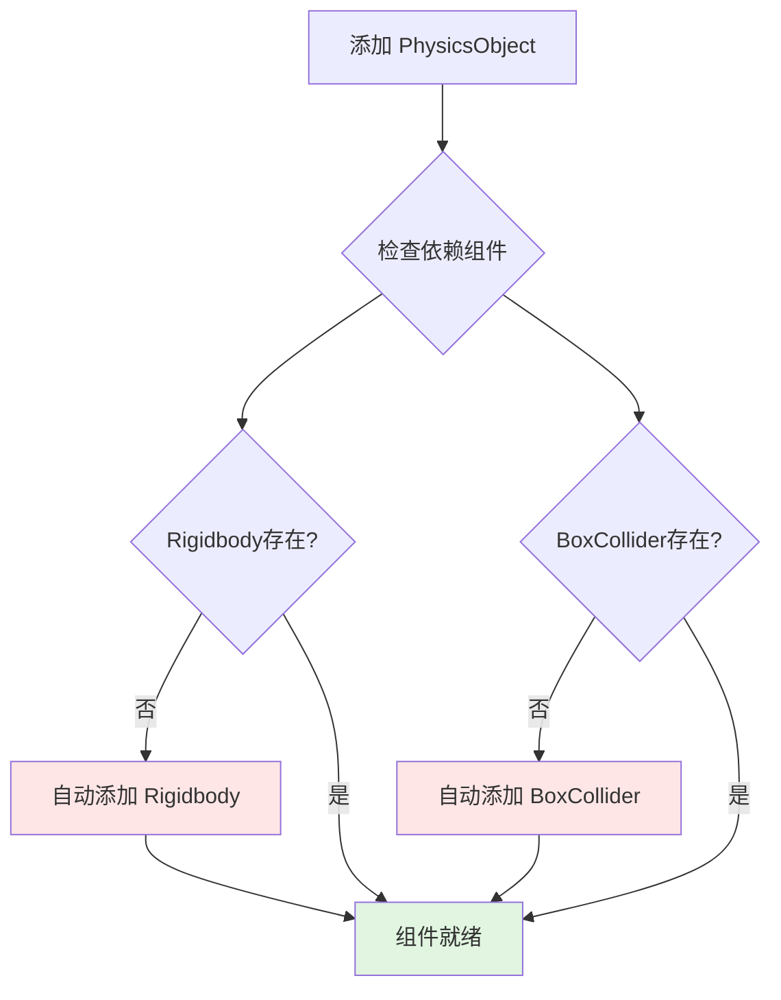
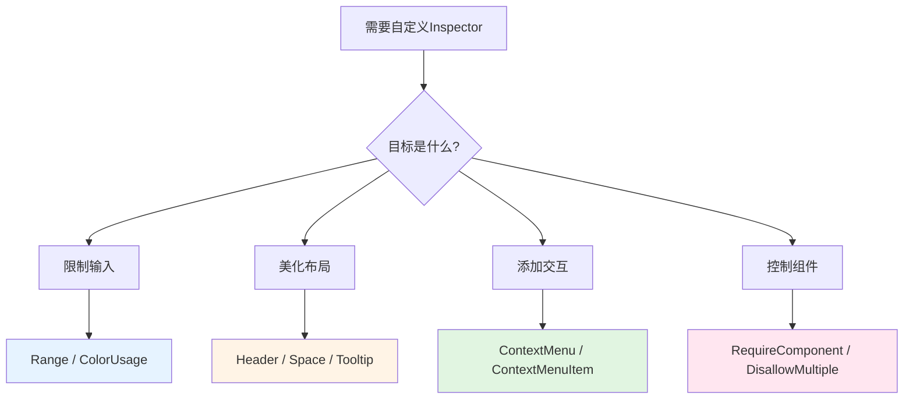

# ✨ Unity Editor 属性特性完全手册：让检视面板焕然一新

> 💡 **想让你的组件更专业吗？**
> - Inspector 面板密密麻麻，字段分类混乱？
> - 策划不知道这个字段是什么意思，总是来问你？
> - 数值范围没有限制，配置出错导致bug？
> - 想让组件看起来更易用、更专业？
>
> **好消息！** 这篇文章将教你用 Unity 的 PropertyAttribute 特性，让检视面板焕然一新，让团队协作效率倍增！

## 📚 目录

- [一、属性特性概述](#一属性特性概述)
- [二、数值范围控制 - Range](#二数值范围控制---range)
- [三、文本显示控制](#三文本显示控制)
- [四、右键菜单扩展 - ContextMenuItem](#四右键菜单扩展---contextmenuitem)
- [五、颜色显示控制 - ColorUsage](#五颜色显示控制---colorusage)
- [六、布局美化特性](#六布局美化特性)
- [七、提示说明 - Tooltip](#七提示说明---tooltip)
- [八、可见性控制 - HideInInspector](#八可见性控制---hideinspector)
- [九、组件依赖 - RequireComponent](#九组件依赖---requirecomponent)
- [十、防止重复组件 - DisallowMultipleComponent](#十防止重复组件---disallowmultiplecomponent)
- [十一、组件菜单 - AddComponentMenu](#十一组件菜单---addcomponentmenu)
- [十二、编辑模式执行 - ExecuteInEditMode](#十二编辑模式执行---executeineditmode)
- [十三、组件菜单命令 - ContextMenu](#十三组件菜单命令---contextmenu)
- [十四、自定义文档链接 - HelpURL](#十四自定义文档链接---helpurl)
- [十五、完整示例](#十五完整示例)
- [十六、总结](#十六总结)

---

## 一、属性特性概述

Unity 提供了一系列继承自 `PropertyAttribute` 的特性类，用于控制字段在 Inspector 中的显示方式。

### 1.1 特性分类

| 📊 分类 | 🔧 特性 | 📝 作用 |
|--------|--------|--------|
| **数值控制** | `Range` | 限制数值范围，显示滑动条 |
| **文本显示** | `Multiline`, `TextArea` | 多行文本输入 |
| **颜色控制** | `ColorUsage` | 颜色选择器配置 |
| **布局美化** | `Header`, `Space` | 分组标题和间距 |
| **提示说明** | `Tooltip` | 鼠标悬停提示 |
| **可见性** | `HideInInspector` | 隐藏公共字段 |

> 💡 这些特性都位于 `UnityEngine` 命名空间，无需额外引用。

**特性分类体系**：



---

## 二、数值范围控制 - Range

`Range` 特性为数值类型字段提供滑动条，限制输入范围。

### 2.1 适用类型

| 📦 类型 | 📖 说明 |
|--------|--------|
| `int` | 整数滑动条 |
| `float` | 浮点数滑动条 |
| `long` | 长整数滑动条 |
| `double` | 双精度浮点滑动条 |

### 2.2 代码示例

```csharp
using UnityEngine;

public class RangeExample : MonoBehaviour
{
    [Range(1, 10)]
    public int level = 1;

    [Range(0f, 100f)]
    public float health = 100f;

    [Range(20.0, 50.0)]
    public double speed = 30.0;

    [Range(60, 10000000)]
    public long score = 0;
}
```

**Range 特性效果示意**：

```
Level (1) ━━━━━━━○━━━━━━━━━━━━━━━━━━━━━━━━━━━ (10)
Health (100) ━━━━━━━━━━━━━━━━━━━━━━━━━━━━━○━━ (0-100)
```

### 2.3 应用场景

| 🎮 场景 | 📊 参数 |
|--------|--------|
| 角色属性 | 等级、生命值、攻击力 |
| 音量控制 | 0-1 范围的音量滑块 |
| 滑动条参数 | 敏感度、缩放比例 |
| 时间控制 | 倒计时、持续时间 |

---

## 三、文本显示控制

### 3.1 Multiline 多行文本

显示一个固定高度的多行文本框。

```csharp
[Multiline(5)]
public string description;
```

### 3.2 TextArea 文本域

更灵活的多行文本输入，可指定最小和最大行数。

```csharp
[TextArea(3, 10)]
public string notes;
```

**对比表格**：

| 🔧 特性 | 最小行数 | 最大行数 | ⭐ 推荐度 |
|--------|---------|---------|----------|
| Multiline | ✅ 固定 | ❌ 无 | ⭐⭐ |
| TextArea | ✅ 可设置 | ✅ 可设置 | ⭐⭐⭐⭐⭐ |

> 💡 **建议**：优先使用 `TextArea`，表现更好且更灵活。

**文本输入控件选择**：



---

## 四、右键菜单扩展 - ContextMenuItem

为字段添加右键菜单选项，快速执行自定义操作。

### 4.1 基本用法

```csharp
using UnityEngine;

public class ContextMenuItemExample : MonoBehaviour
{
    [ContextMenuItem("随机生成", "Randomize")]
    [ContextMenuItem("重置为0", "ResetToZero")]
    public int number = 0;

    private void Randomize()
    {
        number = Random.Range(0, 100);
    }

    private void ResetToZero()
    {
        number = 0;
    }
}
```

**右键菜单效果**：

```
┌─────────────────────┐
│ │ 随机生成          │
│ │ 重置为0           │
└─────────────────────┘
```

### 4.2 特点

| ✨ 特点 | 📖 说明 |
|--------|--------|
| 多菜单项 | 一个字段可添加多个右键菜单项 |
| 共享方法 | 多个字段可调用同一个方法 |
| 方法要求 | 必须是 `private` 或 `protected` 的无参函数 |

### 4.3 应用场景

| 🎯 场景 | 📋 菜单项 | ⚙️ 方法 |
|--------|---------|--------|
| 数值字段 | 随机生成 | 赋随机值 |
| 颜色字段 | 随机颜色 | 生成随机颜色 |
| 数组/列表 | 清空列表 | 清除所有元素 |
| 引用字段 | 自动查找 | FindObjectOfType |

---

## 五、颜色显示控制 - ColorUsage

自定义颜色字段在 Inspector 中的显示方式。

### 5.1 参数说明

```csharp
[ColorUsage(bool showAlpha, bool hdr)]
public Color myColor;
```

| 🎛️ 参数 | 📦 类型 | 📖 说明 |
|--------|--------|--------|
| `showAlpha` | bool | 是否显示透明度通道 |
| `hdr` | bool | 是否启用 HDR 模式（高动态范围） |

### 5.2 代码示例

```csharp
using UnityEngine;

public class ColorUsageExample : MonoBehaviour
{
    // 默认颜色选择器
    public Color defaultColor = Color.white;

    // 不显示透明度
    [ColorUsage(false)]
    public Color noAlphaColor = Color.red;

    // 显示透明度 + HDR 模式
    [ColorUsage(true, true)]
    public Color hdrColor = Color.white;
}
```

### 5.3 HDR 模式特点

| ✨ 特点 | 📖 说明 |
|--------|--------|
| 高亮度值 | 允许颜色值超过 1.0 |
| 发光效果 | 用于 Bloom 后处理 |
| 曝光度滑块 | 颜色选择器显示曝光度控制 |

**颜色选择器模式**：



---

## 六、布局美化特性

### 6.1 Header 分组标题

为字段添加分组标题，提高可读性。

```csharp
using UnityEngine;

public class HeaderExample : MonoBehaviour
{
    [Header("=== 基础属性 ===")]
    public string playerName;

    [Range(1, 100)]
    public int level = 1;

    [Header("=== 战斗属性 ===")]
    public int attack = 10;
    public int defense = 5;
}
```

**Header 效果示意**：

```
┌─────────────────────────────────┐
│ PlayerController (Script)       │
├─────────────────────────────────┤
│ === 基础属性 ===                │
│ Player Name                     │
│ Level              1 ━━━○━━━ 100│
│                                 │
│ === 战斗属性 ===                │
│ Attack              10          │
│ Defense            5            │
└─────────────────────────────────┘
```

> 💡 **提示**：使用装饰符号（如 `===`）可以增强视觉效果。

### 6.2 Space 垂直间距

在字段之间添加空白区域。

```csharp
public int field1;

[Space(10)]
public int field2;

[Space]  // 默认 10 像素
public int field3;
```

| 📏 用法 | 📏 间距大小 |
|--------|-----------|
| `[Space]` | 10px（默认） |
| `[Space(20)]` | 20px |
| `[Space(50)]` | 50px |

---

## 七、提示说明 - Tooltip

为字段添加鼠标悬停提示信息。

```csharp
[Tooltip("角色的当前生命值，0 表示死亡")]
public int health = 100;

[Tooltip("移动速度（单位：米/秒）")]
public float moveSpeed = 5f;
```

> 💡 **提示**：简洁明了的描述能让团队成员快速理解字段用途。

---

## 八、可见性控制 - HideInInspector

隐藏 `public` 字段，使其不在 Inspector 中显示。

```csharp
using UnityEngine;

public class HideInInspectorExample : MonoBehaviour
{
    // 正常显示
    public int visibleField = 10;

    // 隐藏但不影响序列化
    [HideInInspector]
    public int hiddenField = 20;

    // 完全不序列化（也不会显示）
    [System.NonSerialized]
    public int nonSerializedField = 30;
}
```

| 🔍 特性 | 👁️ Inspector | 💾 序列化 |
|--------|-------------|----------|
| 正常 public | ✅ 显示 | ✅ 序列化 |
| `HideInInspector` | ❌ 隐藏 | ✅ 序列化 |
| `NonSerialized` | ❌ 隐藏 | ❌ 不序列化 |

### 应用场景

- 🔒 内部使用的公共字段
- 🔄 通过其他属性间接访问的字段
- 📊 避免 Inspector 过于复杂

**序列化控制决策图**：



---

## 九、组件依赖 - RequireComponent

确保当前组件依赖的其他组件自动存在。

### 9.1 基本用法

```csharp
using UnityEngine;

// 这个组件会自动添加 Rigidbody 和 BoxCollider
[RequireComponent(typeof(Rigidbody), typeof(BoxCollider))]
public class PhysicsObject : MonoBehaviour
{
    private Rigidbody rb;
    private void Awake()
    {
        rb = GetComponent<Rigidbody>();  // 必定存在
    }
}
```

### 9.2 特点

| ✨ 特点 | 📖 说明 |
|--------|--------|
| 自动添加 | 组件被添加时，依赖组件也会自动添加 |
| 防止移除 | 试图移除依赖组件时会弹出警告 |
| 智能去重 | 依赖组件已存在则不会重复添加 |

**组件依赖链**：



---

## 十、防止重复组件 - DisallowMultipleComponent

禁止同一个 GameObject 上添加多个相同类型的组件。

```csharp
using UnityEngine;

[DisallowMultipleComponent]
public class SingletonManager : MonoBehaviour
{
    // 确保只有一个管理器实例
}
```

> ⚠️ 重复添加时会提示："The component cannot be added multiple times to the same Game Object!"

### 应用场景

- 🎯 单例管理器
- 🔑 唯一性组件（如 SaveSystem、AudioManager）

---

## 十一、组件菜单 - AddComponentMenu

自定义组件在 Add Component 菜单中的路径。

### 11.1 基本用法

```csharp
using UnityEngine;

[AddComponentMenu("UI/Tween Color")]
public class TweenColor : MonoBehaviour
{
    // 组件会出现在 Component > UI > Tween Color 菜单下
}
```

### 11.2 嵌套菜单

```csharp
// 多级菜单路径
[AddComponentMenu("Game/Player/Player Controller")]
public class PlayerController : MonoBehaviour
{
}

[AddComponentMenu("Game/Enemy/AI Controller")]
public class AIController : MonoBehaviour
{
}
```

**菜单结构示例**：

```
Component
└── Game
    ├── Player
    │   └── Player Controller
    └── Enemy
        └── AI Controller
```

> 💡 **提示**：合理组织菜单路径可以让团队快速找到需要的组件。

---

## 十二、编辑模式执行 - ExecuteInEditMode

使脚本在编辑模式下也能执行（非运行时）。

### 12.1 基本用法

```csharp
using UnityEngine;

[ExecuteInEditMode]
public class EditModeScript : MonoBehaviour
{
    private void Update()
    {
        // 场景变化时调用
        transform.position += Vector3.up * Time.deltaTime;
    }
}
```

### 12.2 函数调用规则

| ⚙️ 函数 | 🕐 编辑模式调用时机 |
|--------|------------------|
| `Update` | 场景中物体变化时 |
| `OnGUI` | GameView 接收到事件时 |
| `OnRenderObject` | SceneView/GameView 重绘时 |
| `Awake` | 组件加载时 |
| `Start` | 第一次激活时 |

### 12.3 模式切换注意事项

```
┌─────────────────┐      ┌─────────────────┐
│   编辑模式       │  →   │   运行模式       │
│   Edit Mode     │      │   Play Mode     │
└─────────────────┘      └─────────────────┘
         ↓                        ↓
    Awake, Start            Awake, Start
    会被调用                会被调用
```

> ⚠️ **重要**：模式切换时会重新加载资源，`Awake` 和 `Start` 会再次被调用。

### 12.4 应用场景

- 🎨 可视化编辑工具（如关卡编辑器）
- 👁️ 实时预览脚本
- 🛠️ 编辑器辅助功能

---

## 十三、组件菜单命令 - ContextMenu

为组件添加右键菜单命令，作用于整个组件而非单个字段。

### 13.1 与 ContextMenuItem 的区别

| 🔧 特性 | 🎯 作用范围 | 📍 菜单位置 |
|--------|-----------|----------|
| `ContextMenuItem` | 单个字段 | 字段的右键菜单 |
| `ContextMenu` | 整个组件 | 组件的右键菜单（齿轮图标） |

### 13.2 代码示例

```csharp
using UnityEngine;

public class ContextMenuExample : MonoBehaviour
{
    [Range(0, 100)]
    public int number = 50;

    [ContextMenu("随机数字")]
    private void RandomNumber()
    {
        number = Random.Range(0, 100);
    }

    [ContextMenu("重置数字")]
    private void ResetNumber()
    {
        number = 0;
    }

    [ContextMenu("打印数字")]
    private void PrintNumber()
    {
        Debug.Log($"当前数字: {number}");
    }
}
```

**组件右键菜单效果**：

```
┌─────────────────────┐
│ │ 随机数字          │
│ │ 重置数字          │
│ │ 打印数字          │
├─────────────────────┤
│ │ Copy Component    │
│ │ Paste Component   │
│ │ Remove Component  │
└─────────────────────┘
```

---

## 十四、自定义文档链接 - HelpURL

为组件指定自定义文档链接，点击文档图标时打开。

### 14.1 基本用法

```csharp
using UnityEngine;

[HelpURL("https://docs.example.com/my-component")]
public class MyComponent : MonoBehaviour
{
    // 点击 Inspector 中的文档图标将打开指定链接
}
```

### 14.2 注意事项

| ✅ 要求 | 📖 说明 |
|--------|--------|
| 协议 | 必须包含 `http://` 或 `https://` |
| 优先级 | 覆盖默认的 Unity Scripting API 链接 |
| 位置 | 文档图标在 Inspector 组件头部 |

### 14.3 团队文档示例

```csharp
// 内部 Wiki 文档
[HelpURL("https://wiki.company.com/components/PlayerController")]
public class PlayerController : MonoBehaviour
{
}

// GitHub README
[HelpURL("https://github.com/org/repo/blob/main/README.md")]
public class NetworkManager : MonoBehaviour
{
}
```

---

## 十五、完整示例

综合运用多种特性的完整示例：

```csharp
using UnityEngine;

[DisallowMultipleComponent]
[RequireComponent(typeof(Rigidbody))]
[AddComponentMenu("Game/Player Controller")]
[HelpURL("https://docs.example.com/player-controller")]
public class PlayerController : MonoBehaviour
{
    [Header("=== 基础属性 ===")]
    [Tooltip("角色移动速度（单位：米/秒）")]
    [Range(1f, 20f)]
    public float moveSpeed = 5f;

    [Range(0f, 100f)]
    public float maxHealth = 100f;

    [Header("=== 战斗属性 ===")]
    [Tooltip("基础攻击力")]
    public int baseAttack = 10;

    [Tooltip("防御力")]
    public int defense = 5;

    [Header("=== 外观 ===")]
    [ColorUsage(true, false)]
    public Color bodyColor = Color.white;

    [Header("=== 备注信息 ===")]
    [TextArea(2, 5)]
    public string notes = "在此输入备注信息...";

    [HideInInspector]
    public float currentHealth;

    private Rigidbody rb;

    [ContextMenu("重置属性")]
    private void ResetProperties()
    {
        moveSpeed = 5f;
        maxHealth = 100f;
        baseAttack = 10;
        defense = 5;
        currentHealth = maxHealth;
    }

    [ContextMenu("满血恢复")]
    private void FullHealth()
    {
        currentHealth = maxHealth;
    }

    private void Awake()
    {
        rb = GetComponent<Rigidbody>();
        currentHealth = maxHealth;
    }
}
```

**完整组件 Inspector 效果**：

```
┌────────────────────────────────────────┐
│ PlayerController (Script)       📖     │
├────────────────────────────────────────┤
│ === 基础属性 ===                       │
│ Move Speed (m/s)    5 ━───○──── 20    │
│ Max Health          100 ━━━○━━━ 100   │
│                                        │
│ === 战斗属性 ===                       │
│ Base Attack         10                │
│ Defense            5                  │
│                                        │
│ === 外观 ===                           │
│ Body Color           ■                │
│                                        │
│ === 备注信息 ===                       │
│ Notes                                │
│ ┌────────────────────────────────┐   │
│ │ 在此输入备注信息...             │   │
│ │                                │   │
│ └────────────────────────────────┘   │
└────────────────────────────────────────┘
```

---

## 十六、总结

本文介绍了 Unity 编辑器常用的 14 种属性特性：

| 📊 分类 | 🔧 特性 |
|--------|--------|
| **数值控制** | Range |
| **文本显示** | Multiline, TextArea |
| **交互扩展** | ContextMenuItem, ContextMenu |
| **颜色控制** | ColorUsage |
| **布局美化** | Header, Space |
| **提示说明** | Tooltip |
| **可见性** | HideInInspector |
| **组件依赖** | RequireComponent |
| **组件限制** | DisallowMultipleComponent |
| **菜单组织** | AddComponentMenu |
| **编辑执行** | ExecuteInEditMode |
| **文档链接** | HelpURL |

> 💡 **核心价值**：合理使用这些特性，可以让你的组件在 Inspector 中更加专业和易用！

**特性选择决策图**：



---

**转载请注明来源**，欢迎对文章中的引用来源进行考证，欢迎指出任何有错误或不够清晰的表达。可以在下面评论区评论，也可以邮件至 1487842110@qq.com
